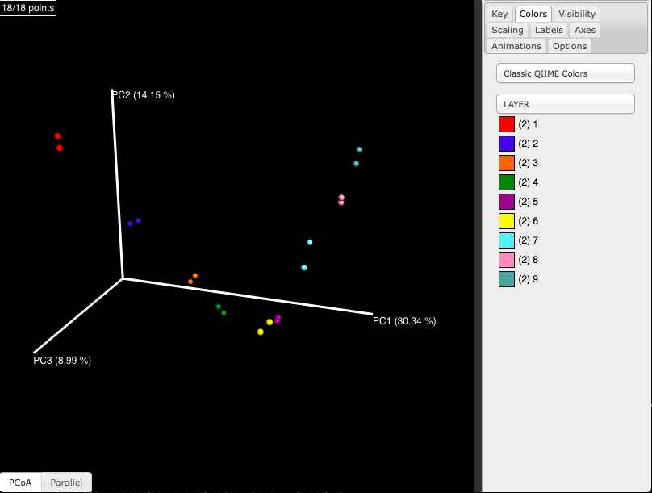
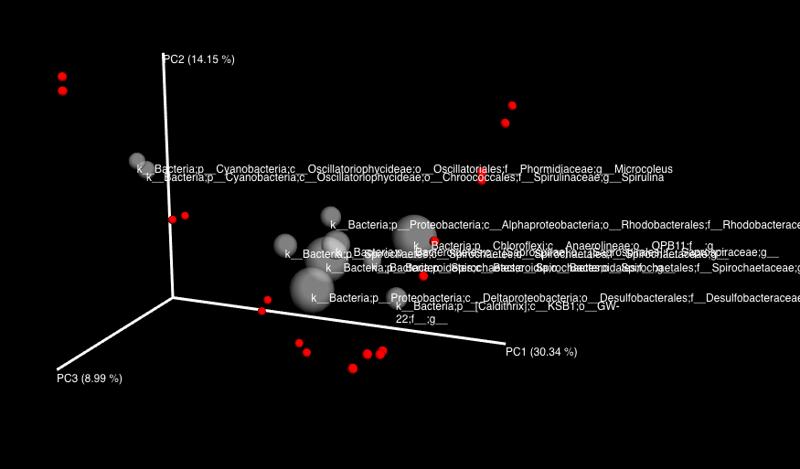
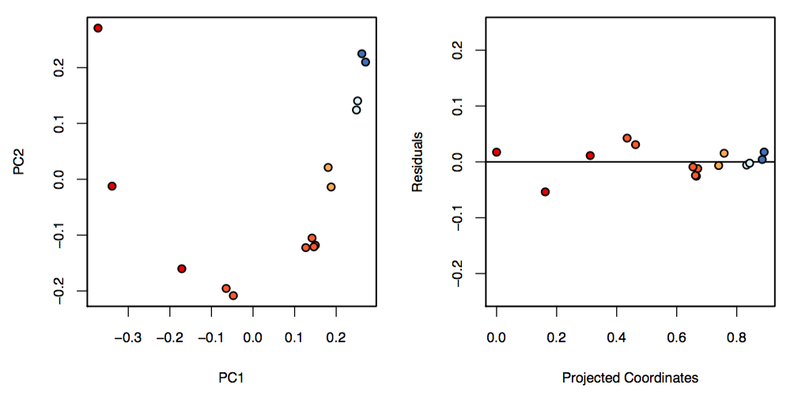

Back to [Table of Contents](../../doc/index.html)  

**All of the code in this page is meant to be run in ```R``` unless otherwise specified.**

## Load data and calculate distance metrics. For more explanations of these commands see [Beta diversity](beta.diversity.html)
```{r eval=TRUE}
library('biom')
library('vegan')

# load biom file
otus.biom <- read_biom('otu_table_json.biom')

# Extract data matrix (OTU counts) from biom table
otus <- as.matrix(biom_data(otus.biom))

# transpose so that rows are samples and columns are OTUs
otus <- t(otus)

# convert OTU counts to relative abundances
otus <- sweep(otus, 1, rowSums(otus),'/')

# load mapping file
map <- read.table('map.txt', sep='\t', comment='', head=T, row.names=1)

# find the overlapping samples
common.ids <- intersect(rownames(map), rownames(otus))

# get just the overlapping samples
otus <- otus[common.ids,]
map <- map[common.ids,]

# get Euclidean distance
d.euc <- dist(otus)

# get Bray-Curtis distances (default for Vegan)
d.bray <- vegdist(otus)

# get Chi-square distances using vegan command
# we will extract chi-square distances from correspondence analysis
my.ca <- cca(otus)
d.chisq <- as.matrix(dist(my.ca$CA$u[,1:2]))
```

## Ordination: PCA
Outside the field of ecology people often use principal components analysis (PCA). PCA is equivalent to calculating Euclidean distances on the data table, and then doing principal coordinates analysis (PCoA). The benefit of PCoA is that it allows us to use any distance metric, and not just Euclidean distances.

We will calculate PCA just for demonstration purposes. In practice, Euclidean distance is generally not a good distance metric to use on community ecology data. PCA will only work if there are more samples than features, so we will calculate it using just the top 10 OTUs.
```{r eval=TRUE}
# get the indices of the 10 dominant OTUs
otu.ix <- order(colMeans(otus),decreasing=TRUE)[1:10]

# PCA on the subset including 10 OTUs
pca.otus <- princomp(otus[,otu.ix])$scores

# For comparison, do PCoA on Euclidean distances
pc.euc <- cmdscale(dist(otus[,otu.ix]))

# plot the PC1 scores for PCA and PCoA
# note: we might have to flip one axis because the directionality is arbitrary
# these are perfectly correlated
plot(pc.euc[,1], pca.otus[,1])
```

## Ordination: NMDS
Another common approach is non-metric multidimensional scaling (MDS or NMDS). We can do this using the Vegan package. We will apply this to Bray-Curtis distances and plot the ordination colored by physical sample depth in the microbial mat.
```{r, eval=TRUE}
# NMDS using Vegan package
mds.bray <- metaMDS(otus)$points

# makes a gradient from red to blue
my.colors <- colorRampPalette(c('red','blue'))(10)

layer <- map[,'LAYER']
plot(mds.bray[,1], mds.bray[,2], col=my.colors[layer], cex=3, pch=16)
```

## Ordination: PCoA
NMDS seems to work fine at recovering a smooth gradient along PC1. Let us compare to PCoA on the same Bray-Curtis distances.
```{r, eval=TRUE}
# Run PCoA (not PCA)
pc.bray <- cmdscale(d.bray,k=2)
plot(pc.bray[,1], pc.bray[,2], col=my.colors[layer], cex=3, pch=16)
```

In general, PCoA and NMDS tend to give similar results. PCoA is more common in microbiome analysis.

## Biplots
One benefit of PCA over PCoA is that it automatically provides "loadings" for the features (OTUs/taxa/genes) along each axis, which can help visualize which features are driving the positions of samples along the principal axes of variation. This kind of plot is called a "biplot". Fortunately there are ways to produce biplots using PCoA. The way that we make biplots with PCoA is to plot each species as a weighted average of the positions of the samples in which it is present. The weights are the relative abundances of that species in the samples.
```{r, eval=TRUE}
# First get a normalized version of the OTU table
# where each OTU's relative abundances sum to 1
otus.norm <- sweep(otus,2,colSums(otus),'/')

# use matrix multiplication to calculated weighted average of each taxon along each axis
wa <- t(otus.norm) %*% pc.bray

# plot the PCoA sample scores
plot(pc.bray[,1], pc.bray[,2], col=my.colors[layer], cex=3, pch=16)

# add points and labels for the weighted average positions of the top 10 dominant OTUs
points(wa[otu.ix,1],wa[otu.ix,2],cex=2,pch=1)
text(wa[otu.ix,1],wa[otu.ix,2],colnames(otus)[otu.ix],pos=1, cex=.5)
```

## 3D PCoA in QIIME
QIIME allows very useful data visualization and exploration with 3D PCoA plots. 

**These commands must be run on the command line**
```{r eval=FALSE, engine='bash'}
# TO BE RUN ON THE COMMAND LINE, NOT IN R
beta_diversity.py -i otu_table.biom -o beta -t ../ref/greengenes/97_otus.tree
principal_coordinates.py -i beta/unweighted_unifrac_otu_table.txt -o beta/pcoa_unweighted_unifrac_otu_table.txt

# note: --number_of_segments makes spheres smoother; leave out for large data sets
make_emperor.py -i beta/pcoa_unweighted_unifrac_otu_table.txt -m map.txt -o 3d --number_of_segments 12
```

Then open the resulting `index.html` file in your web browser.


You can also make biplots directly in QIIME. You will need to have a **tab-delimited** (.txt) taxon summary file.

**These commands must be run on the command line**
```{r eval=FALSE, engine='bash'}
# TO BE RUN ON THE COMMAND LINE, NOT IN R
# get genus-level taxa
summarize_taxa.py -i otu_table.biom -L 6

# Run make_emperor.py with taxon summary
make_emperor.py -i beta/pcoa_unweighted_unifrac_otu_table.txt -t otu_table_L6.txt -m map.txt -o 3d --number_of_segments 12
```



Note: you can click the "Labels" tab and "Biplots Label Visibility" to turn on labels. You can edit the taxon summary file in Excel to shorten the labels if needed.

## Detrending
You can detrend using QIIME `detrend.py`. The current version (QIIME 1.9+) requires that you remove some extra lines at the top and bottom of the PCoA file, which you can do with this command **on the command line**:
```{r eval=TRUE, engine='bash'}
# TO BE RUN ON THE COMMAND LINE, NOT IN R
# replace the name of the input and output files with your file names
cat beta/pcoa_unweighted_unifrac_otu_table.txt | tail -n+10 | sed -e :a -e '$d;N;2,4ba' -e 'P;D' > beta/pcoa_unweighted_unifrac_otu_table_for_R.txt
```

Now run `detrend.py` on the pcoa file. I recommend suppressing prerotation with `-r` unless you end up with a slightly rotated horseshoe.
```{r eval=TRUE, engine='bash'}
# TO BE RUN ON THE COMMAND LINE, NOT IN R
detrend.py -i beta/pcoa_unweighted_unifrac_otu_table_for_R.txt -m map.txt -c END_DEPTH -r -o detrend
```

Then examine the `summary.txt` file in the output folder. This shows the correlation of the expected gradient in your metadata (END_DEPTH here) with PC1 and PC2 before and after detrending, as well as the correlation of the detrended 2D scores with the raw 2D scores.
```{r eval=TRUE, engine='bash'}
# TO BE RUN ON THE COMMAND LINE, NOT IN R
cat detrend/summary.txt
```

The resulting PDF shows the ordination before/after detrending:


This is a rather hacky way of doing detrending. During class we derived a 
```{r eval=TRUE}
# load the local gradient distance function we derived
source('../../src/local.gradient.distance.r')

# calculated the local gradient distances with k = 3
d <- lg.dist(d.bray,neighborhood.size=3)

# plot regular principal coordinates
pc <- cmdscale(d)
plot(pc[,1], pc[,2], col=my.colors[layer],pch=16,cex=3, ylim=range(pc), xlim=range(pc),main='Local gradient distance')
```
