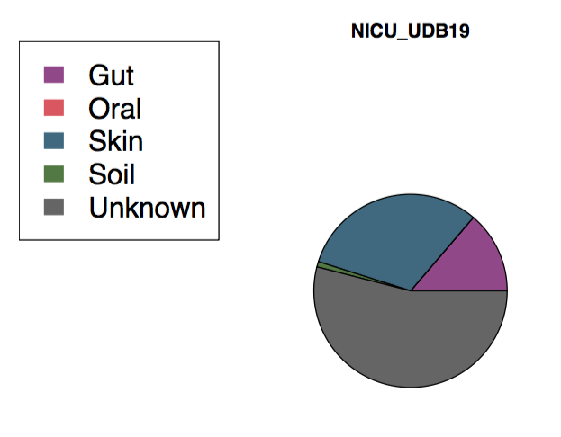

Back to [Table of Contents](index.html)  

**All of the code in this page is meant to be run in on the command line unless otherwise specified.**

##Install SourceTracker  
First, get SourceTracker from github.com  
**These commands must be run on the command line**  
```{r eval=FALSE, engine='bash'}
# clone the repo
git clone https://github.com/danknights/sourcetracker.git

# Enter the repository folder
cd sourcetracker

# Create a system variable called SOURCETRACKER_PATH pointing to this directory
# We will add it to a .Renviron file in your home directory.
echo "" >> $HOME/.Renviron
echo "SOURCETRACKER_PATH=$PWD" >> $HOME/.Renviron


```

## Run SourceTracker on example data
This will run SourceTracker with only 2 restarts. Note: on MSI, run this first: `module load R`
```{r eval=FALSE, engine='bash'}
Rscript sourcetracker_for_qiime.r -i data/otus.txt -m data/metadata-subset.txt -o outdir -v -n 2
```

This will produce pie charts, bar charts, and distribution charts (see Figure 2C in SourceTracker paper). For example, we can see a mixture of gut and oral sources on the NICU surface in `sink_predictions_pie_NICU.pdf`:



